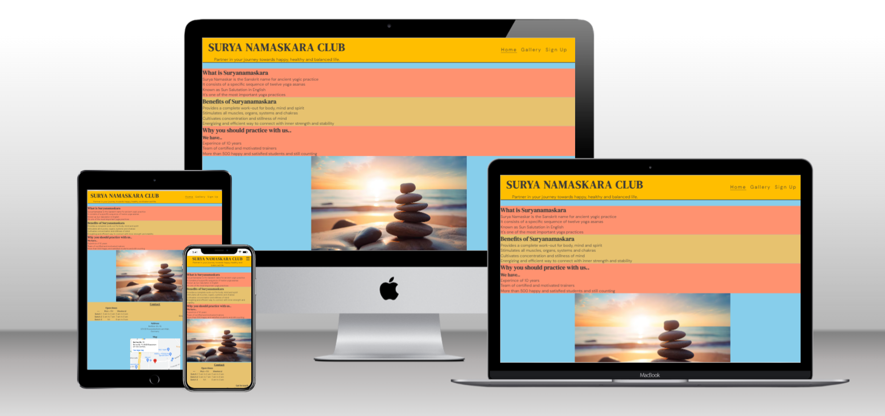

# Surya Namaskara Club
The Surya Namaskara Club website is a webiste which provides information about a club located in Ruesselsheim, Germany. The website tells that the club is for everyone who is looking for a way to achieve happy, healthy and balanced life, irrespective of the gender or age.

Users of this website will be able to find some basic information about the Suryanamaskara and benefits of doing the same. It provides information about the ongoing batches-(time and days), contact details (phone number and email address) and address of the club.
There are some photos included, so that the users will get idea about interior of the club and what kind of activities are performed there.  

There is also a quick sign up form, so if the users of the website find it interesting, they can easily enroll for a batch online.The site is responsive for all screen sizes.

 

## Features
* Navigation Bar
    -  Featured at the top of all three pages, the navigation links are situated to the right. 
    -  On larger screens they show the text; Home, Gallery and Sign Up. On smaller screens, such as mobiles, the navigation links are shown in the form of a burger-icon that expands when you click it.

* The Header
    -  At the top left in the header section, there is a name of the club 'Surya Namaskara Club' displayed as logo, that will take the user to the home page when clicked.   
    -   Below the logo a small tagline is displayed -'Partner in your journey towards happy, healthy and balanced life.' This tagline will make the new user of the website feel curious to know more about the club..

        

* The Home page

    - This is the opening page, with top section giving information about suryanamaskara. So the user will get to know what does the name Suryanamaskara means. 
    - Below that user can read benefits of suryanamaskara and why one should join this particular group. This aspires to motivate the user to join the group as a step towards a happy, healthy and balanced life.    
    - A picture showing balancing stones at the beach, taken at the time of a calm sunrise. As suryanamaskara is mostly performed at the time of sunrise, this picture represents the calmness and balance one will experince after performing suryanamaskara..

        

    - Next comes contact section, displaying timing and days of the ongoing batches, phone number and the email id, where they could contact to collect more information.

    - Then address of the club is displayed.

        

* The Footer
    -   The footer section includes relevant links to Facebook, Twitter, Youtube  and Instagram.
    -   The links will open in a new tab and they aspire to give the user more motivation to take next step towards healthy life.

* The Gallery page
    -   On the Gallery page user can view some photos of a group performaing suryanamaskara and other asanas(postures). The photos are taken inside the club, so that user will get idea about the interior of the club and what kind of activities are performed there. User can read name of the posture below the respective picture.      
        
        

* The Sign Up page
    -   Finally sign up page is there, where a contact form is provided. On the form user can provide their basic information like name, email address, age etc, and could join the club on just click of a button. One can also provide their preference in terms of days, like weekdays or weekend, when they could attend the practice.
        

### Features left to implement
    
    - I would like to add a page displaying feedback from some former and current students of the club. 
    I will put their image and their thoughts about the club and what positive changes on health and overall life they felt, after starting suryanamaskara will be shown as a quoted text.

    After reading it, users of the website will surely be encouraged to join the club.

## Testing
-   Accessibility
    -   run the pages through Lighthouse 
    
    ![Screenshot of Lighthouse result]
 
-  
-   I tested and confirmed that all internal links are working and redirecting the user between the pages.
-   I tested that all external links, to social media sites, are woking and opening in a separate tab.
-   I tested and confirmed that the contact form works, all fields are required, the radio buttons are required (one of them), the email field only accepts email address, and the submit button link works:

    
-   HTML
    -   No errors found when running the code through the [W3C HTML Validator](https://validator.w3.org/)

-   CSS
    -   No errors found when running the code through the [W3C CSS Validator](https://jigsaw.w3.org/css-validator/) 
    

## Bugs
-   
### Unfixed bugs
-   No unfixed bugs

## Deployment

### Version Control
-   The site was created using Gitpod editor and pushed to Github to the remote repository 'Surya-Namaskara-Club'.
-   Git commands were used throughout the development to push the code to the remote repository. The following git commands were used:
    -   git add . - to add the files to the staging area before being committed.
    -   git commit -m "commit message" - to commit changes to the local repository queue that are ready for the final step.
    -   git push - to push all committed code to the remote repository on Github.

### Deployment to Github pages
-   The site was deployed to Github pages as follows:
    -   In the Github repository, I navigated to Settings tab
    -   From the source section drop-down menu, I selected the Master branch and Save
    -   Once the Master branch was selected, the page provided the link to the website
-   The live link: [Surya Namaskara Club](
https://amrutakulkarni01.github.io/Surya-Namaskara-Club/)

### Cloning of the Repository Code locally
-   Go to the Github repository that you want to clone
-   Click on the Code button located above all the project files
-   Click on HTTPS and copy the repository link
-   Open the IDE of your choice and and paste the copied git url into the IDE terminal
-   The project is now created as a local clone