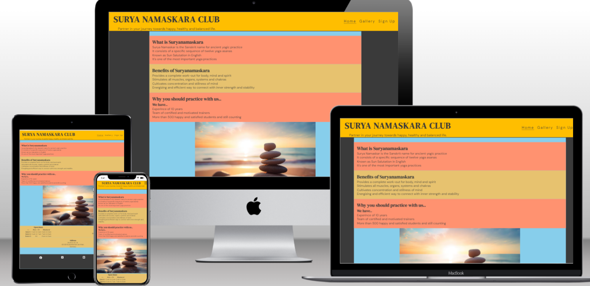

# Surya Namaskara Club
The Surya Namaskara Club website is a webiste which provides information about a club located in Ruesselsheim, Germany. The website tells that the club is for everyone who is looking for a way to achieve happy, healthy and balanced life, irrespective of the gender or age.

Users of this website will be able to find some basic information about the Suryanamaskara and benefits of doing the same. It provides information about the ongoing batches-(time and days), and address of the club along with a map showing exact location.
There are some photos included, so that the users will get idea about interior of the club and what kind of activities are performed there.  

There is also a quick sign up form, so if the users of the website find it interesting, they can easily enroll for a batch online.The site is responsive for all screen sizes.

 

## Features
* Navigation Bar
    -   Featured at the top of all three pages, the navigation links are situated to the right. 
    -  On larger screens they show the text; Home, Gallery and Sign Up. On smaller screens, such as mobiles, the navigation links are shown in the form of a burger-icon that expands when you click it.

* The Header
    -  At the top left in the header section, there is a name of the club 'Surya Namaskara Club' displayed as logo, that will take the user to the home page when clicked.   
    -   Below the logo a small tagline is displayed -'Partner in your journey towards happy, healthy and balanced life.' This tagline will make the new user of the website feel curious to know more about the club..

* The Home page
 